# Blender SpriteSheet Importer

While looking for a streamlined way to export 8-way direction characters to use in Godot, I came across [this YouTube video](https://www.youtube.com/watch?v=l1Io7fLYV4o) that provided a nice setup for my experiments.
I started working with it, and was satisfied with the results except importing the generated spritesheets in Godot required a lot of manual work.
To automate this process, I created an import add-on that hopefully simplifies importing these animations. 
I made up a JSON format representing the resulting animations that can be directly imported in Godot as a `SpriteFrames` resource to be used in an `AnimatedSprite2D` node.

As a side note, kudos to Godot developers for the editor plugin architecture - it's very powerful and only took me an hour to get this code working by following the [step by step tutorial](https://docs.godotengine.org/en/stable/tutorials/plugins/editor/making_plugins.html).

## Tutorial

Here's a quick tutorial on how to use this plugin, importing a Mixamo animated model in Blender to generate 8-way 2D animations ready for use in Godot.

### Plugin installation

First and foremost, you have to import the plugin from the AssetLib.
Currently the plugin is not yet part of the Asset store, so you have to download the [zip file](https://github.com/oddmode-studio/BlenderSpriteSheetImporter/releases/latest) and import it manually:

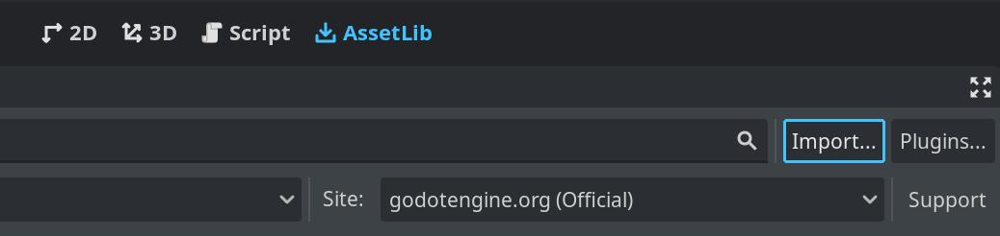

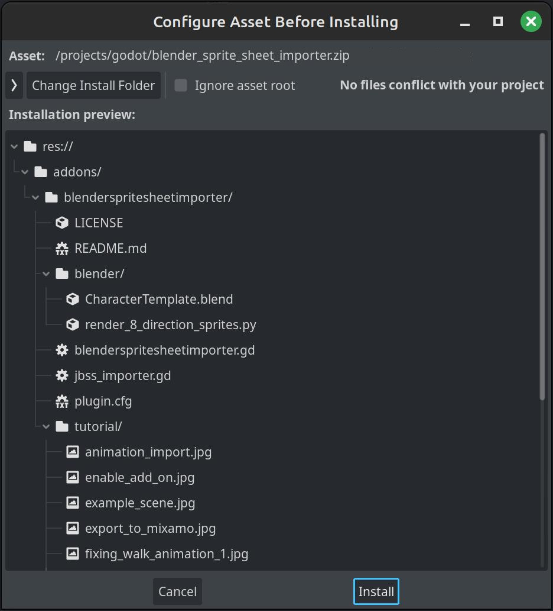

After a successful installation you can delete the `tutorial` folder, but keep the `blender` folder as it contains both the scene template and the Python script to export the spritesheets.

Enable the plugin in the Project Settings:

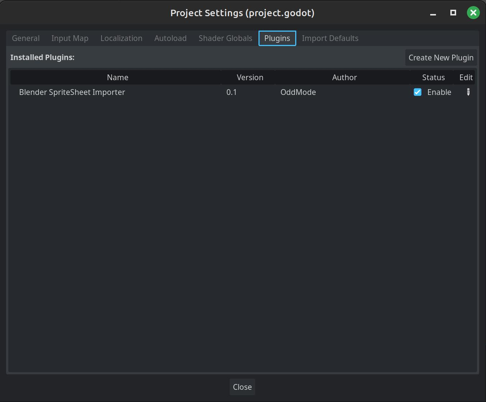

Now Godot supports opening files with `.JBSS` extension as `SpriteFrames` objects. How do you create this kind of files? Let's jump to Blender!

### Create the model and the animations

The requirement to generate the spritesheets is obviously having a model to animate or, in case you lack the artistic skills like I do, finding one on the internet.
In this tutorial I use this [Monk Character](https://sketchfab.com/3d-models/monk-character-8cacbd85a5b84f59a8c9000d7a6dcca2) from SketchFab (thanks [Inuciian](https://sketchfab.com/Inuciian) for your model and the permissive license).

I used Mixamo to apply some animations on it, so to import the model there I first had to open it in Blender and export it to .FBX format. 
Once the model is exported, go to [Mixamo](www.mixamo.com), select the animation you prefer (I chose Lite Magic Pack, which holds 14 different animations, but I will only export 3 of them in this tutorial), click on "Upload character" and drag your exported FBX file.
When Mixamo completes its magic, you can preview the animations and if you're satisfied with them you can hit "Download". 

I used these setting for download: 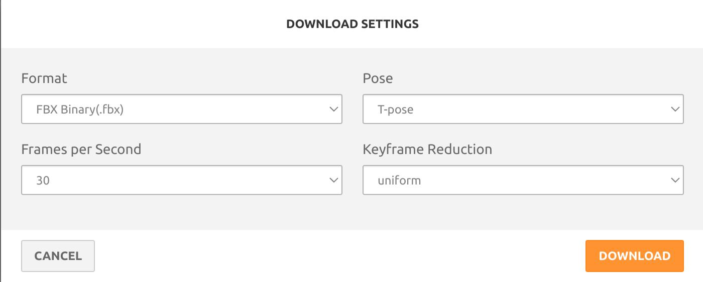 
This will give you a ZIP file with 14 FBX files containing the animations, plus the original FBX model you uploaded earlier.

### Blender setup

Copy the files from the `addons/blenderspritesheetimporter/blender` folder somewhere handy (I use the `assets/raw/` folder of the Godot project so I can keep it alongside the resulting spritesheets).

> Please note that the next steps are similar to the ones described in the above-mentioned [video](https://www.youtube.com/watch?v=l1Io7fLYV4o). If something is not clear in this tutorial, you may refer to the video for the Blender scene setup.

Open Blender (I used 4.0.2, but the workflow should be similar in other versions as well), remove the default cube and do `File -> Import -> FBX` to import the files you downloaded from Mixamo.
I imported the animations "standing idle.fbx", "Standing Walk Forward.fbx" and "Standing 1H Magic Attack 01.fbx".

They will appear in the Outline view as `Armature_Monk.xxx` nodes:

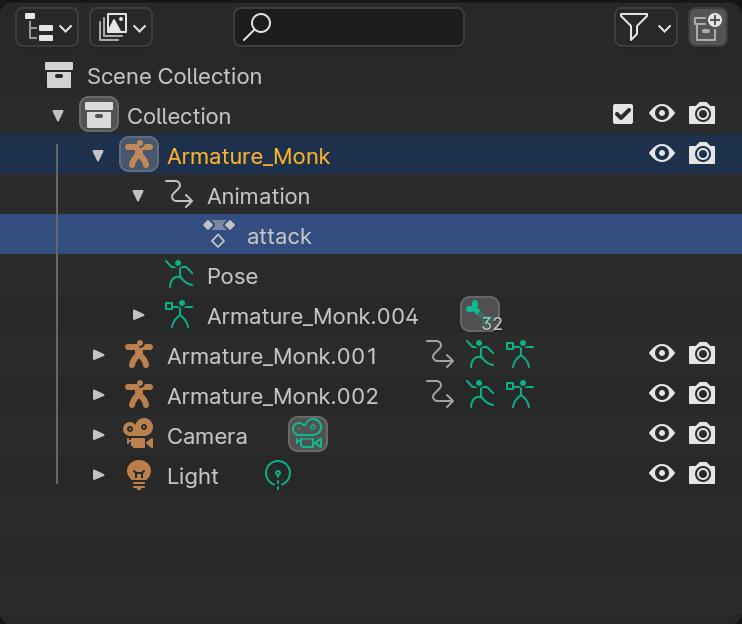

You will have to identify which animation is stored in each node and provide a meaningful name so you can distinguish them later, as I did for `attack` in the above picture.

For the `walk` animation, the armature is moving forward (there is no way to chose to animate "in place" from Mixamo for this animations pack) but we want everything to happen on the origin, so the animation should stay in place.
To achieve that, I opened the Dope Sheet window, the Action Editor subwindow, and selected the `Y Location` track for the corresponding Armature_Monk node:

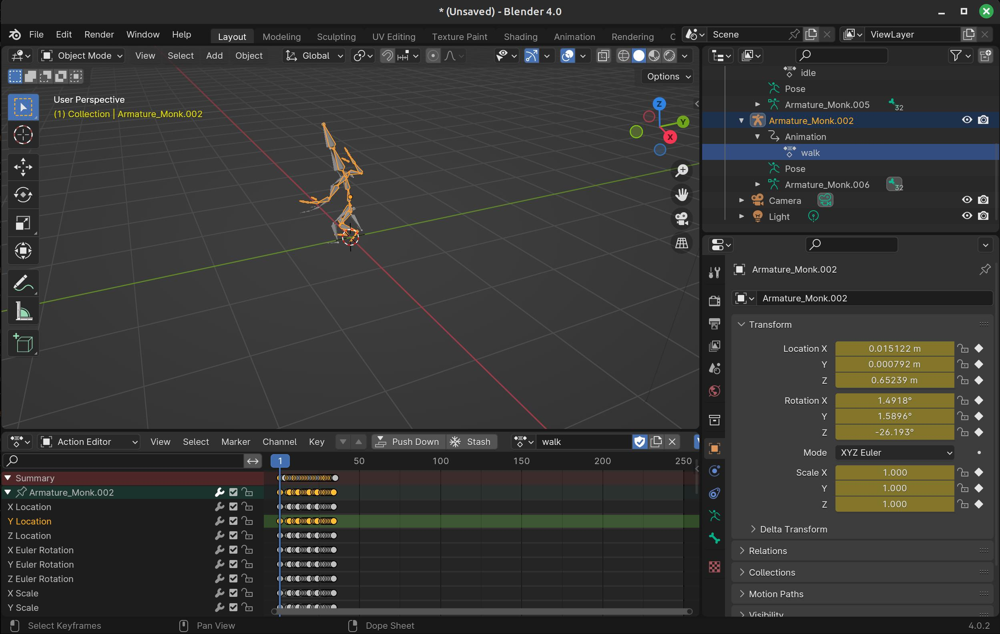

then:

- pressed `Ctrl+Tab` to switch to the Graph Editor
- pressed `Shift+H` to hide all the unselected nodes, leaving just the `Y Location` curve visible
- `Right click on the selected nodes -> Snap -> "Selection to cursor value"` (as you can see the cursor Y position was set to 0, so this sets all keys in the animation to have a `Y Location` of 0):

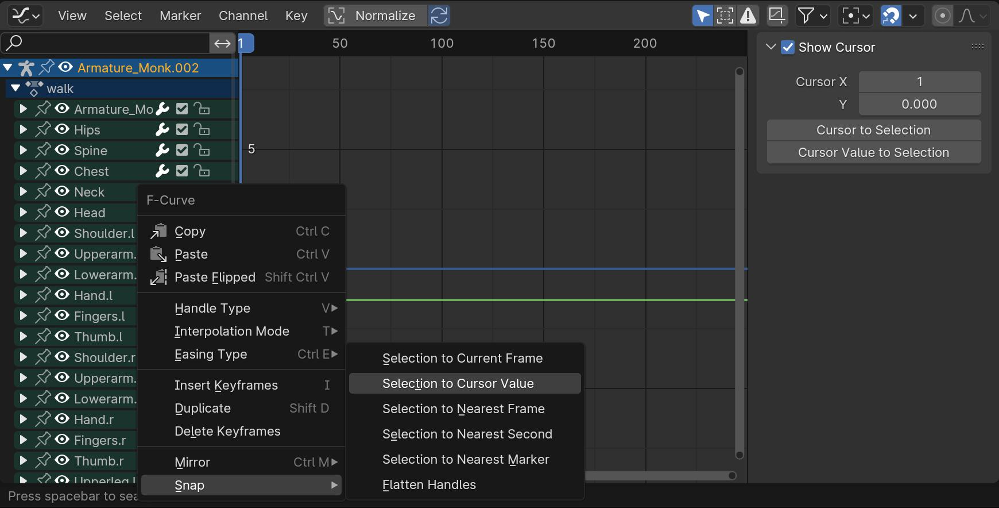

- press `Alt+H` to unhide the hidden nodes

The end results of this operation should be a walk animation that happens in place on the origin (please note I am not a Blender expert, so YMMV... but hopefully the end result is clear).
Now save the resulting document as a new Blender file (I called it `animations.blend`), and then open the `CharacterTemplate.blend` file you copied earlier from the addon folder (please keep a separate copy from the one that comes with the add-on, so you can use the original to repeat this operation for other models if you need that).

This file has a basic setup with an `Empty`, a `Camera` which is constrained to look at the `Empty`, and a `Light` that follows the camera around. This is your stage.
Load the model that you originally uploaded to Mixamo using `File -> Import -> FBX`, then select the corresponding FBX file (you should have a copy also in the ZIP file you downloaded from Mixamo).

The model should land at the origin, which is exactly where we want it:

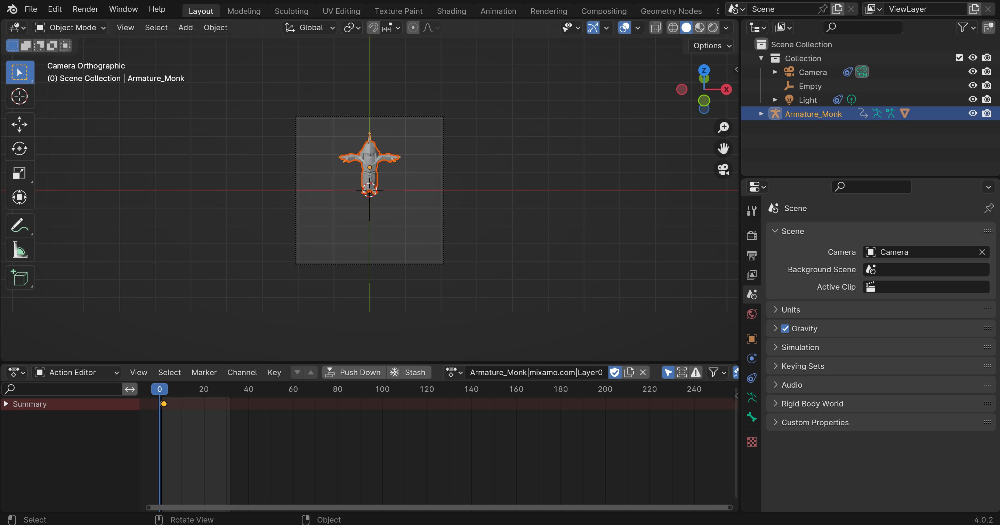

Then, it's time to import the animations, by selecting `File -> Append`, select the previously saved `animations.blend` file, and navigate to the `Action` folder:

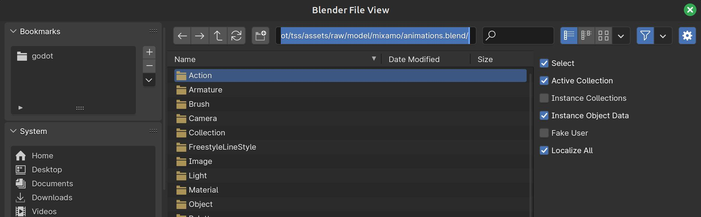

and finally select the desired animations and click on `Append`:

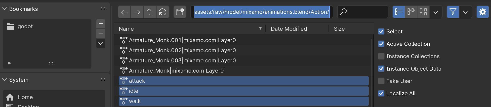

Finally, open the `Dope Sheet` window, the `Action Editor` subwindow, and for each of the imported animations:

- select the animation:

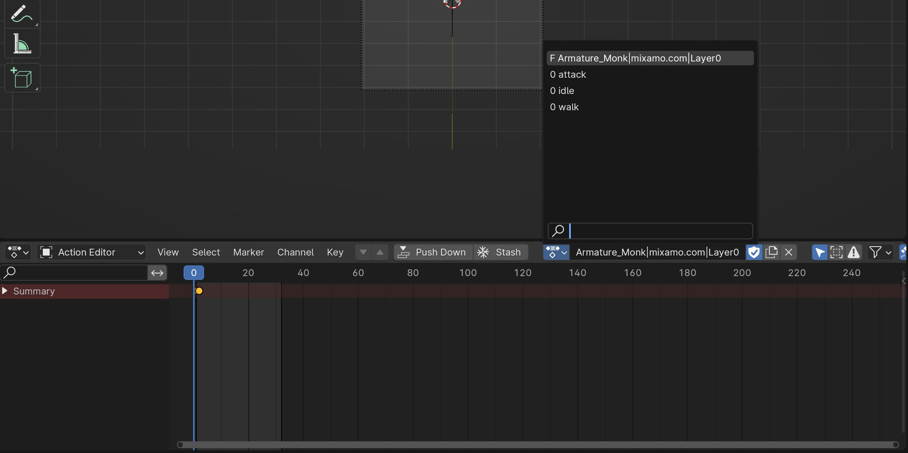

- click on the `Push Down` button to create a NLA track for the animation:

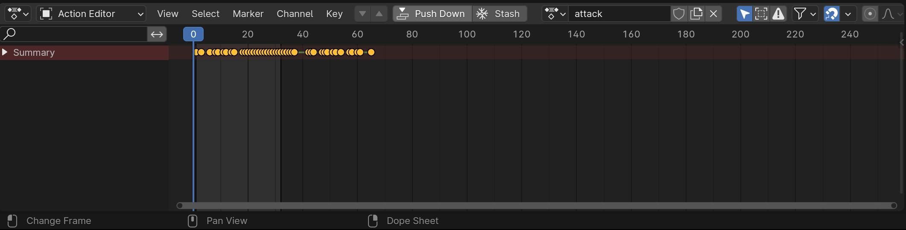

The end result should look similar to this:

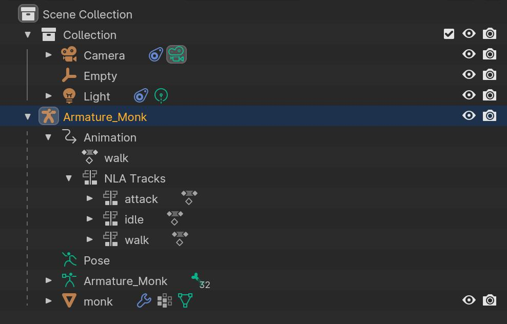

Your character should be set up so that it is facing towards the camera, and this will be the rendering of the animation heading South.

Press `F12` to render your image and verify the animation fits the rendered viewport, the light is correct, the textures are correctly applied to the model etc.

You can move the `Empty` object around to modify the `Camera` target, or change the lens `Orthographic Scale` setting of the camera to zoom in or out.

As you will probably also need transparency to be enabled, verify the corresponding `Transparent` check box in the `Render properties -> Film` settings is enabled. 
Once everything looks fine, save your `.blend` file and get ready to export the spritesheets.

### Exporting the spritesheets

Using Blender, open the `.blend` file you just created containing the model and desired animations, and switch to the `Scripting` window.
Here, select `Text -> Open` and load the `render_8_direction_sprites.py` file you copied from the add-on folder.
This script is in charge of rendering your animations at different angles and create a spritesheet description file that can be then imported in Godot.

At the very beginning of the script you will find some variables that drive the export process.

`OUTPUT_FOLDER` indicates the folder where all the frames will be stored (this will be created if not existing, otherwise make sure it is empty or you risk overwriting existing contents).

`DEFAULT_LOOP` sets the looping flag for the exported animations (this is the default, you can change it later in the generated JBSS file if required).

`DEFAULT_FPS` sets the resulting animations frames per second for the exported animations (this too can be changed later in the JBSS file).

`OUTPUT_W` is the frame width, or the horizontal resolution of the rendered images.

`OUTPUT_H` is the frame height, or the vertical resolution of the rendered images.

`RENDERED_DIRECTIONS` is an array with the directions to render. The defaults are ok for 8-ways spritesheets, but you can set this to `[ "N", "E", "S", "W" ]` for 4-ways.

`RENDERED_ANIMATIONS` is an array with the animations to render. These must match the names of the desired NLA tracks.

`RENDER_EVERY_X_FRAMES` indicates how many frames to skip between rendered frames in each animation. The default is 1, so every frame will be rendered, but you can set it to 2 (render every other frame) or more to reduce the number of rendered images.

`FORCE_RENDER_LAST_FRAME` if set to `True`, this will force the rendering of the last frame of the animation even if it would be skipped by the `RENDER_EVERY_X_FRAMES` configuration. This allows for smoother loops in some animations.

`PROCESS_NORMALS` if set to `True` the normal map of each frame will be exported alongside the frame itself, and the corresponding animation will automatically be imported in Godot to be used as a normal map.

Once the configuration of these variables is complete, you can select the object node to render (the parent of the NLA tracks) and press the `Run Script` button:

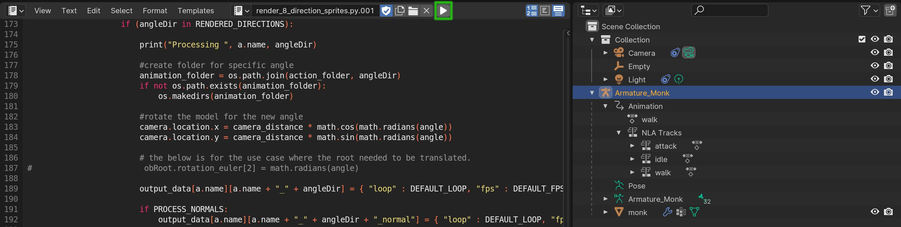

While the process is running Blender will not respond to user inputs... don't worry, that's ok. Once the processing is complete, you will get a message in the Python console.
Sometimes the script crashes Blender mentioning memory leaks if you switch from Blender to a different window during the rendering, at least on my Linux box...  but fortunately this happens only after the export is complete, so it is not a showstopper.

### What does the script do?

In a nutshell, the script will render all the frames of the selected animations, rotating the camera in 45 degrees steps to render all the selected directions, eventually also rendering the corresponding normal maps.
It will create a hierarchy of folders within the specified `OUTPUT_FOLDER`, where the first level of the hierarchy is the name of the animation being rendered, and the second level is the direction.
Within this second level folders you will find the frames (PNG files) and the normal maps (JPG files with a `normal_` prefix), numerically sorted.

To render the normal maps, the script automatically sets up some nodes in the Blender Compositor. 
If you need some specific Compositor operations to suit you art style, you will have to change the script accordingly and create a dedicated output node.
This is left as an exercise for the reader, as the code should be straightforward to follow (just look at the `PROCESS_NORMALS` handling).

Finally, once the export process is complete, the script will create a JBSS file, which can be fed to Godot to import all the animations via this add-on.

### What is a JBSS file?

Basically, something I made up to simplify importing animations into Godot.
The add-on simply installs a new import handler specifically written to interpret JBSS files.
These files are simple JSON documents containing a Dictionary, where the keys are the names of the animations rendered, and their subkeys are again Dictionaries for all the directions rendered.
Within these sub-keys, there are currently two fields: 
- a number, `fps`, which indicates the frames per second for the specific animations
- a boolean, `loop`, which indicates whether the animation must automatically loop or not

### How to use the animations in Godot

Once you ran the Blender script successfully, you will have a folder containing a JBSS file and one or more subfolders containing the exported frames.
Create a new Godot project, drag that folder in your new project, so that all individual frames will be imported, and then enable the add-on in your project settings:


this should trigger the import of the JBSS file. Then, create a new 2D scene and add an `AnimatedSprite2D` node to the scene:


Finally, drag the `sprite_sheets.jbss` file from the file system to the `Sprite Frames` property of the `AnimatedSprite2D` node:

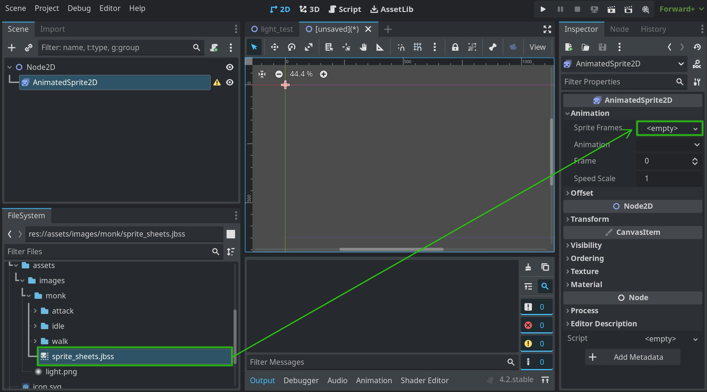

Now the `Animation` drop down should list all the imported animations, and the Animation Editor in the lower pane should show you all the imported frames for each animation.

If you need to change the looping flag or the FPS for any animation, you can manually modify the corresponding `fps` and `loop` elements in the JBSS file and reimport it in Godot; your changes will be applied to the animations, without requiring you to manually do that from the Godot editor. For example, in this case I manually set the `loop` field for all the `attack_*` animations to `false` in `sprite_sheets.jbss`, as I did not want these to repeat.

> Please beware of the fact that, as a consequence, if you manually change anything in these animations in Godot after importing them and then modify the JBSS file, Godot will reimport it overwriting your manual changes!

Here's a hackish script you can use to test the imported animations:

```gdscript
extends CharacterBody2D

const SPEED = 200.0

# Start facing south
var _direction : int = 2

var directions = [
"E",
"SE",
"S",
"SW",
"W",
"NW",
"N",
"NE",	
]

# Silly state machine
enum { MONK_WALKING, MONK_ATTACK, MONK_IDLE } 
var _status = MONK_WALKING


func on_animation_finished():
	_status = MONK_WALKING
		
		
func on_frame_changed():
	if _status == MONK_ATTACK:
        if $monk.get_frame() == 8:
		    print("Emit fireball!")

func _ready():

	_status = MONK_WALKING
	$monk.animation_finished.connect(self.on_animation_finished)
	$monk.frame_changed.connect(self.on_frame_changed)
	$monk.set_animation("walk_S")
	
func _physics_process(_delta):

	if not _status == MONK_ATTACK:
		# Get the input direction and handle the movement/deceleration.
		# As good practice, you should replace UI actions with custom gameplay actions.
		var direction_x = Input.get_axis("ui_left", "ui_right")
		if direction_x:
			velocity.x = direction_x * SPEED
		else:
			velocity.x = move_toward(velocity.x, 0, SPEED)

		var direction_y = Input.get_axis("ui_up", "ui_down")
		if direction_y:
			velocity.y = direction_y * SPEED
		else:
			velocity.y = move_toward(velocity.y, 0, SPEED)
			
		if direction_y == 0 and direction_x == 0:
			_status = MONK_IDLE
			$monk.animation = "idle_" + directions[_direction]
			$monk.play()
			
		else:
			var dir = Vector2(direction_x, direction_y)
			
			var angle = (2 * PI + dir.angle() + PI / 4)
			if angle > 2 * PI:
				angle -= 2 * PI
			_direction = clamp(round(angle / PI * 4) - 1, 0, 8)
			$monk.animation = "walk_" + directions[_direction]
			$monk.play()

		move_and_slide()

	# Handle attack.
	if Input.is_action_just_pressed("ui_accept"):
		_status = MONK_ATTACK
		velocity = Vector2.ZERO
		$monk.animation = "attack_" + directions[_direction]
		$monk.play()
```

The node hierarchy should be the following one, with the script attached to the `CharacterBody2D` node:

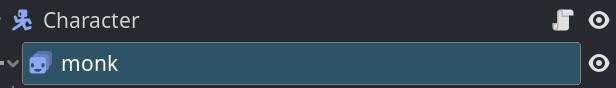

and these are the results:

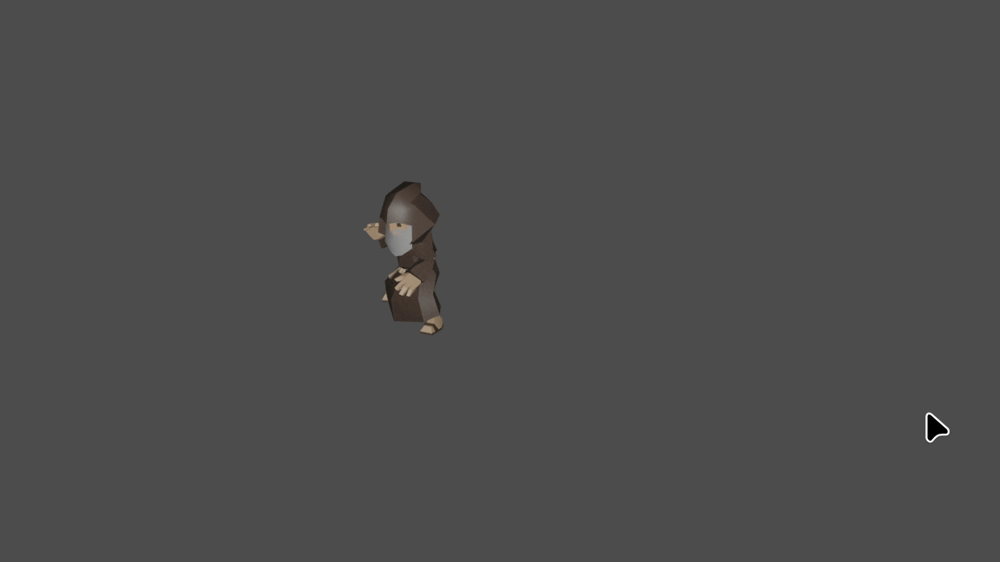

The light in Blender was a bit too harsh, or the model material a bit too shiny... but fixing those issues should be simple enough, now that the setup is ready.

This is all, hopefully you managed to follow the tutorial and are now able to create your sprite assets a bit faster. Have fun!
